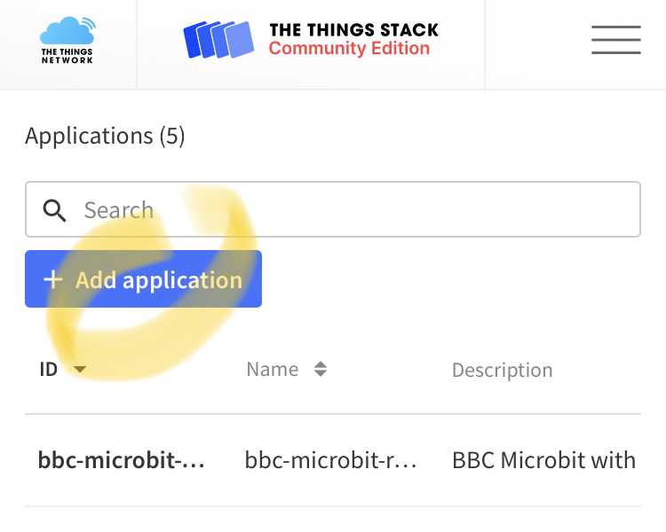

# Sensor remoto y autónomo de ruido ambiental 
Este dispositivo se ha diseñado para monitorizar el ruido ambiental de forma indefinida utilizando energia solar. 

Por otra parte se van a utilizar comunicaciones de largo alcance tipo LPWAN (Low Power Wide Area Networks). En este caso será una modluación **LoRa** (Long Range) que además es muy eficientes en el consumo de energía. La tecnología LoRa y la capa de red abierta LoRaWAN son los protagonistas del despliegue del IoT.

## Material utilizado
- Hemos utilizado la [placa Heltec HTCC-AB01](https://es.aliexpress.com/item/1005001288501966.html) para la banda ISM europea de 868MHz que tiene las siguientes caracteristicas:
  - Compatible con Arduino, por tanto compatible en Windows, Mac OS y Linux
  - Configurable a través de comandos AT
  - Chip CP2102 de puerto serie a USB integrado
  - Basada en ASR605x (ASR6501, ASR6502) , esos chips ya están integrados el PSoC ®  4000 serie MCU (ARM ®  cortex ® M0 + Core) y SX1262;
  - Soporte de la especificación LoRaWAN 1.0.2
  - Diseño de energía ultra bajo, sólo 3.5uA en Deep Sleep. Para este tipo de proyecto, el consumo son muy importantes y aquí tenemos es tabla que ayudará a dimensionar la bateria y el panel solar:
   
  - Sistema de gestión de energía solar incluido, se puede conectar directamente con un panel solar de 5-7 V
  - Conector SH1.25-2 para baterías incluido, sistema de administración de batería integrado (administración de carga y descarga, protección de sobrecarga, detección de energía de la batería, conmutación automática de energía de batería / USB)
  - Interfaz micro USB con protección ESD (Electrostatic Discharge), protección contra cortocircuitos, blindaje RF y otras medidas de protección
  - Buena correspondencia de impedancia y larga distancia de comunicación
  - Certificación CE y FCC


Podremos encontrar toda la documentación de esta placa en: [Documentos y ficheros](https://resource.heltec.cn/download/CubeCell), [FAQs](https://github.com/HelTecAutomation/HeltecDocs/blob/master/en/source/cubecell/frequently_asked_questions.md) 

- [Batería de polímero de litio de 3,7V y conector JST SH1.0 de 1,0mm y dos pines](https://es.aliexpress.com/item/4000288987647.html)


- [Panel solar de 6V](https://es.aliexpress.com/item/4001128543657.html)


- [SparkFun Sound Detector](https://www.sparkfun.com/products/14262)


- [Carcasa hermética IP66](https://es.aliexpress.com/item/33060319519.html)


Por otra parte también se necesitarán otros componentes no electrónicos como cables, mini-protoboard... lo que conforma este kit:


## Conexionado

Del microcontrolador CubeCell sólo vamos a utilizar el pin 2 que corresponde al único conversor analógico/digital de la placa. Intermante es el mismo que utiliza para ver el estado de carga de la bateria. Por lo que perderemos esta función.  


Otro detalle a tener en cuenta respecto a la alimentación del sensor de sonido, es que aunque sería recomendable utilizar una tensió de 5V que suministraria la placa por el pin VIN. Este sólo tiene tensión cuando se alimenta por USB. Por lo que tendremos que utilizar el pin VDD que suministra 3.3 en la configuración de bateria y son suficientes para que el sensor funciones correctamente.


## Configuración IDE Arduino
Lo para poder programar adecuadamente el dispositivo tendremos que configurar el entorno de programación de Arduino con las configuraciones de hardware y librerias de esta placa.
1. Añadir la URL https://github.com/HelTecAutomation/CubeCell-Arduino/releases/download/V1.4.0/package_CubeCell_index.json a Preferences->Settings->Additional boards:
2. 

## Configuración del sensor en la nube (TTN)

Vamos a utilizar los servicios de The Things Network que es un servicio en la nube al que están conectados los _gateway_ libres de la las Comunidades TTN. 
La ruta de la información es la siguiente:
1. El sensor (_nodo_) transmite por radio con modulación LoRa el trama de datos que recibe el _gateway_
2. Este _gateway_ está conectado a internet para retransmitir la trama, hora como paquete de datos.
3. Los servidores de TTN decodifican el mensaje y ofrecen diferentes intefraciones y _endpoints_ para que nuestras aplicaciones utilicen la información leida por los sensores.

Hay muchas variantes para implementar este enrutamiento. Para este se ha eleguido estas configuraciones:
- Dispositivo es del tipo ABP (Activation-by-personalisation) lo que significa que se identificará en la red con un _DevAddr_ y una _Session key_ preconfigurada. Para ello tenemos que completar el registro de una aplicación y un dispositivo. 
- Publicación del paquete de-codificado en una cola MQTT a la que nuestra aplicación está subscrita.


Estos son los pasos a seguir empezando por acceder a la aplicación _back-end_ de TTN en esta URL: https://console.cloud.thethings.network/ en la que seleccionaremos nuestra región y luego nos loguearemos con nuestro usuario registrado.

### Registro de la aplicación
En TTN los dispositivos (_devices_) iguales, se agrupan en una aplicación desde la cual serán registrados. por lo tanto, primero hay que añadir una aplicación:




En el formulario de alta de aplicación rellenaremos estos campos: 
- Para el _Application ID_, elige un identificador único, en minúsculas, puedes usar caracteres alfanuméricos peor no guiones ´-´ consecutivos.
- Para  _Description_, elige la descripcion que prefieras.
- No hace falta poner nada en _Application EUI_ 
- Presiona _Create application_ para finalizar


#AQUI

Ahora seremos redirigidos a la página con la nueva aplicación añadida donde puedes encontrar la _app EUI_ y el _Access Keys_ generados.
<br>


### Registro del dispositivo


En TTN un dispositivo (devide) representa la configuración de lo que también llama nodo (node) que a fin de cuentas es nuestro circuito. 
Al acceder al formulario de registro, únicamente tenemos que rellenar el _Device ID_ que será el nombre único de este nodo. Es preferible pulsar el icono marcado en la imagen para que se genere automáticamente el _Device EUI_.


<br>
<br>
<br>
<br>
<br>
<br>
<br>

Finalmente pulsaremos _Register_ y pulsaremos el icono con el nombre de nuestro nuevo dispositivo para ver sus datos de configuración. Aquí encontraremos los parámetros que necesitamos por ser un dispositivo de tipo ABP. Y que tendremos que pasar al fichero de configuración settings.h que se cargará en el _sketch_ del IDE de Arduino.
Pero el formato para las Keys es diferente. Encontrarás aquí una hoja excel (Encode_EUI.xlsx) que te facilitará esta tarea.

```cpp
/* OTAA para*/
uint8_t devEui[] = { 0x00, 0x00, 0x00, 0x00, 0x00, 0x00, 0x00, 0x00 };
uint8_t appEui[] = { 0x00, 0x00, 0x00, 0x00, 0x00, 0x00, 0x00, 0x00 };
uint8_t appKey[] = { 0x00, 0x00, 0x00, 0x00, 0x00, 0x00, 0x00, 0x00, 0x00, 0x00, 0x00, 0x00, 0x00, 0x00, 0x00, 0x00 };

/* ABP para*/
uint8_t nwkSKey[] = { 0x00, 0x00, 0x00, 0x00, 0x00, 0x00, 0x00, 0x00, 0x00, 0x00, 0x00, 0x00, 0x00, 0x00, 0x00, 0x00 };
uint8_t appSKey[] = { 0x00, 0x00, 0x00, 0x00, 0x00, 0x00, 0x00, 0x00, 0x00, 0x00, 0x00, 0x00, 0x00, 0x00, 0x00, 0x00 };
uint32_t devAddr =  ( uint32_t )0x00000000;

/* Other params */
const int TransmitPeriod = 60000; //Milisecons
```

### Formato de la trama


Tendremos que volver a la pantalla de _Application Overbiew_ para hacer una última configuración. Pulsando en la pestaña de _Payload Formats_ accedemos al formulario donde se permite poner un script para decodificar la trama de datos de nuestro mensaje LoRa. En nuestro caso este es el formato:


## Agradecimientos
https://learn.sparkfun.com/tutorials/sik-experiment-guide-for-the-arduino-101genuino-101-board-spanish/experimento-15-usar-la-placa-de-detector-de-sonido

