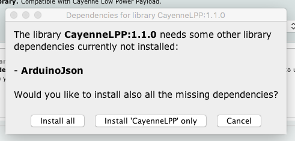
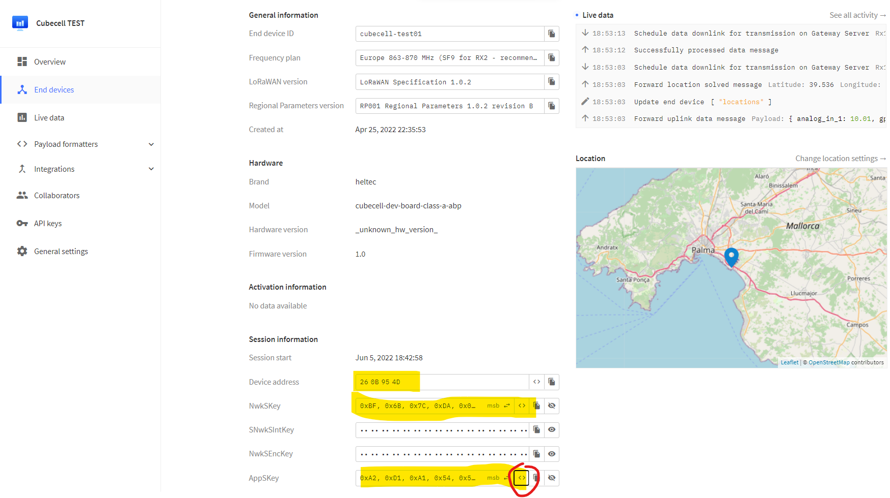

#   Sensor remoto y autónomo de ruido ambiental 
Este dispositivo se ha diseñado para monitorizar el ruido ambiental de forma indefinida utilizando energia solar. 

Por otra parte se van a utilizar comunicaciones de largo alcance tipo LPWAN (Low Power Wide Area Networks). En este caso será una modluación **LoRa** (Long Range) que además es muy eficientes en el consumo de energía. La tecnología LoRa y la capa de red abierta LoRaWAN son los protagonistas del despliegue del IoT.

## Material utilizado
- Hemos utilizado la [placa Heltec HTCC-AB01](https://es.aliexpress.com/item/1005001288501966.html) para la banda ISM europea de 868MHz que tiene las siguientes caracteristicas:
  - Compatible con Arduino, por tanto compatible en Windows, Mac OS y Linux
  - Configurable a través de comandos AT
  - Chip CP2102 de puerto serie a USB integrado
  - Basada en ASR605x (ASR6501, ASR6502) , esos chips ya están integrados el PSoC ®  4000 serie MCU (ARM ®  cortex ® M0 + Core) y SX1262;
  - Soporte de la especificación LoRaWAN 1.0.2
  - Diseño de energía ultra bajo, sólo 3.5uA en Deep Sleep. Para este tipo de proyecto, el consumo son muy importantes y aquí tenemos es tabla que ayudará a dimensionar la bateria y el panel solar:
   
  - Sistema de gestión de energía solar incluido, se puede conectar directamente con un panel solar de 5-7 V
  - Conector SH1.25-2 para baterías incluido, sistema de administración de batería integrado (administración de carga y descarga, protección de sobrecarga, detección de energía de la batería, conmutación automática de energía de batería / USB)
  - Interfaz micro USB con protección ESD (Electrostatic Discharge), protección contra cortocircuitos, blindaje RF y otras medidas de protección
  - Buena correspondencia de impedancia y larga distancia de comunicación
  - Certificación CE y FCC


Podremos encontrar toda la documentación de esta placa en: [Documentos y ficheros](https://resource.heltec.cn/download/CubeCell), [FAQs](https://github.com/HelTecAutomation/HeltecDocs/blob/master/en/source/cubecell/frequently_asked_questions.md) 

- [Batería de polímero de litio de 3,7V y conector JST SH1.0 de 1,0mm y dos pines](https://es.aliexpress.com/item/4000288987647.html)


- [Panel solar de 6V](https://es.aliexpress.com/item/4001128543657.html)


- [SparkFun Sound Detector](https://www.sparkfun.com/products/14262)


- [Carcasa hermética IP66](https://es.aliexpress.com/item/33060319519.html)


Por otra parte también se necesitarán otros componentes no electrónicos como cables, mini-protoboard... lo que conforma este kit:


## Conexionado

Del microcontrolador CubeCell sólo vamos a utilizar el pin 2 que corresponde al único conversor analógico/digital de la placa. Intermante es el mismo que utiliza para ver el estado de carga de la bateria. Por lo que perderemos esta función.  


Otro detalle a tener en cuenta respecto a la alimentación del sensor de sonido, es que aunque sería recomendable utilizar una tensió de 5V que suministraria la placa por el pin VIN. Este sólo tiene tensión cuando se alimenta por USB. Por lo que tendremos que utilizar el pin VDD que suministra 3.3 en la configuración de bateria y son suficientes para que el sensor funciones correctamente.


## Configuración IDE Arduino
Lo para poder programar adecuadamente el dispositivo tendremos que configurar el entorno de programación de Arduino con las configuraciones de hardware y librerias de esta placa.
1. Añadir la URL https://github.com/HelTecAutomation/CubeCell-Arduino/releases/download/V1.5.0/package_CubeCell_index.json a Preferences->Settings->Additional boards:
2. Añadir la libreria de CayenneLPP. **Importante: versión 1.1.0**:


3. Si aparece un aviso de instalar otras librerias con dependencias. Seleccionar opción de instalar todas:



4. Seleccionar la tarjeta CubeCell HTCC-AB01 y configurar todos sus parámetros así:


### Subir el sketch de Arduino
Con el cable conectado seleccionamos el puerto USB que nuestro ordenador haya asignado. Una vez compilado y cargado en el dispositvo. Abrimos el monitor serie para comprobar que log de actividad del programa es correcto.

## Configuración del sensor en la nube (TTN)

Vamos a utilizar los servicios de The Things Network que es un servicio en la nube al que están conectados los _gateway_ libres de la las Comunidades TTN. 
La ruta de la información es la siguiente:
1. El sensor (_nodo_) transmite por radio con modulación LoRa el trama de datos que recibe el _gateway_
2. Este _gateway_ está conectado a internet para retransmitir la trama, hora como paquete de datos.
3. Los servidores de TTN decodifican el mensaje y ofrecen diferentes intefraciones y _endpoints_ para que nuestras aplicaciones utilicen la información leida por los sensores.

Hay muchas variantes para implementar este enrutamiento. Para este se ha eleguido estas configuraciones:
- Dispositivo es del tipo ABP (Activation-by-personalisation) lo que significa que se identificará en la red con un _DevAddr_ y una _Session key_ preconfigurada. Para ello tenemos que completar el registro de una aplicación y un dispositivo. 
- Publicación del paquete de-codificado en una cola MQTT a la que nuestra aplicación está subscrita.


Estos son los pasos a seguir empezando por acceder a la aplicación _back-end_ de TTN en esta URL: https://console.cloud.thethings.network/ en la que seleccionaremos nuestra región y luego nos loguearemos con nuestro usuario registrado.

<br>
<br>
<br>
<br>
<br>
<br>
<br>

### Registro de la aplicación
En TTN los dispositivos (_devices_) iguales, se agrupan en una aplicación desde la cual serán registrados. por lo tanto, primero hay que añadir una aplicación:

En el formulario de alta de aplicación rellenaremos estos campos: 
- Para el _Application ID_, elige un identificador único, en minúsculas, puedes usar caracteres alfanuméricos peor no guiones ´-´ consecutivos.
- Para  _Description_, elige la descripcion que prefieras.
- No hace falta poner nada en _Application EUI_ 
- Presiona _Create application_ para finalizar


<br>
<br>
<br>
<br>
<br>
<br>
<br>
<br>

Aparecerá ahora la página con la nueva aplicación añadida donde encontrarás un botón de _+ Add end device_ necesario para crear los dispositivos asociados. 


### Registro del dispositivo
En TTN un dispositivo (devide) representa la configuración de lo que también llama nodo (node) que a fin de cuentas es nuestro sensor. 
Al acceder al formulario de registro nos quedamos en la pestaña de _From The LoRaWAN Device Repository_ ya que estamos usando un microcontrolador conocido.
Ahora tenemos que seleccionar el tipo, modelo y marca de nuestro sensor tal y como aparece en la captura inferior. 
Generar la _Device address, AppSKey y NwkSKey_ pulsando el icono marcado en la imagen para que se genere automáticamente.
Y finalmente rellenar el _Device ID_ que será el nombre único de este nodo.


Finalmente pulsaremos _Register en device_ para que, seguidamente aparezca la pantalla con la configuración de nuestro nuevo nodo.Aquí podremos ver los datos de configuración y parámetros que necesitamos por ser un dispositivo de tipo ABP. Y que tendremos que pasar al fichero de configuración settings.h que se cargará en el _sketch_ del IDE de Arduino.



Para poder copiar las _keys_ en el formato "array" que se requiere en el fichero de configuración. Hay que pulsar el icono <> de "_toggle array formating_"

```cpp
// LoRaWAN Configuration

/* ABP para*/
uint8_t nwkSKey[] = { 0x88, 0x88, 0x88, 0x88, 0x88, 0x88, 0x88, 0x88, 0x88, 0x88, 0x88, 0x88, 0x88, 0x88, 0x66, 0x01 };
uint8_t appSKey[] = { 0x88, 0x88, 0x88, 0x88, 0x88, 0x88, 0x88, 0x88, 0x88, 0x88, 0x88, 0x88, 0x88, 0x88, 0x66, 0x01 };
uint32_t devAddr =  ( uint32_t )0x00000000;

// Devise location
const float latitude = 39.936;
const float longitude = 3.718;
const int alt = 30;

// Other params
float SensorId= 10.02;// Sensor  identifcator number 
const int ReadDutyCycle = 600000; // Transmision and reading period
```

### Formato de la trama

Desde el menú vertical izquierdo accederemos al _Payload Formatters_ y la opción Uplink para definir cómo decodificar la trama de datos de nuestro mensaje LoRa que hemos establecido en el firmware. En nuestro caso hemos usando la librería CayenneLPP y esto es lo que aquí tenemos de seleccionar como tipo:


De esta manera el mensaje MQTT que vamos a utilizar para leer los valores del sensor; será generado por backend de TTN en una estructura JSON perfectamente formateada:

```json
{
 "uplink_message":{
      "f_port":2,
      "f_cnt":539,
      "frm_payload":"AQID6QFlAE8CZQDDAogGCGAAaiwAC7g=",
      "decoded_payload":{
         "analog_in_1":10.02,
         "gps_2":{
            "altitude":30,
            "latitude":39.936,
            "longitude":3.718
         },
         "luminosity_1":79,
         "luminosity_2":195
      }
}
```
### Integración MQTT
Por último necesitaremos las credenciales de acceso al broker MQTT que TTN nos ofrece como una opción de integración para poder suscribirnos a topic desde nuestra aplicación:


**IMPORTANTE**: copia el password ahora porque una vez cerrada esta ventana. No tendrás opción a consultarlo.

## Análisis de la señal
Cuando hablamos de sonido o de ruido, la magnitud que se utiliza con mayor frecuencia son los dBA. Los fabricantes de dispositivos utilizan mucho esta escala logarítmica en sistemas de audio.
Pero para llegar a esta medida, haremos varias transformaciones y calibrados.
1.A Partimos que el sensor de sonido SparkFun Sound Detector nos da una medida analógica con un rango desde 0 a 4500. Ya que se aplica un filtro de banda alta para eliminar los _outlier_. Pero esta medida analógica no es el valor instantaneo del sonido o presión sonora. Si no la envolvente de 1 segundo de muestreo calculada por el circuito del sensor. Linea verde del gráfico:

1.B Y tenemos que determinar el valor base que corresponda con la medida en silencio.
2. Calculamos el valor medio del periodo de ciclo de transmisión que es de 10 minutos. Aunque lo correcto sería aplicar la fórmula.
3. msg.noise_LAeq = noise_calibration * 20 * Math.log10(Number(noise_avg)/noise_baseline);


## Gráficas y alarmas en Node-RED
Partimos de una instacia Node-RED con nodo para mostrar un interface de usuario que se llama _dashboard_. Lo que se puede hacer desde la opción _Manage Palette_ de la aplicación de administración.

Se ha construido un sencillo flujo para representar unas gráficas y poder establecer un umbral de alerta para enviar un mensaje a IFTTT


El cual genera el siguiente dashboard:


En el flujo de Node-RED se tratan y muestran gráficamente los mensajes MQTT leidos. El _payload_ contiene el json con los valores de:
- Ruido medio en "luminosity_1"
- Ruido pico en "luminosity_2"
- Id de sensor en "analog_in_1"
- Coordenadas geográficas en "gps_2"

Para importar el flujo deberemos acceder a la aplicación Node-RED que tenemos arrancada donde encontraremos la opción de importar pulsando el botón de menú tipo hamburguesa. Lo más fácil es copiar al portapapeles de equipo el contenido del fichero jaleometro_nodered_ui_mqtt y pegarlo en la pantalla:


Tras pulsar el botón de ¨import¨ tendrás la vista de los nodos y los flujos. Pero hay tres de ellos que no están correctamente configurados.

### Configuración cliente MQTT
Encontrarás todo configurado excepto las crecenciales de acceso. Para utilizar las que has obtenido en los pasos anteriores. Solo tienes que ir a las propiedades del nodo MQTT, editar el _Server_ y acceder a la pestaña _Security_:


### Configurar integración con IFTTT
La integración con IFTTT (If This Then That) está montada con una sencilla llamada a su _endpoint_ REST utilizando en nodo tipo _http request_ con el siguiente formato. 
<br>
```
https://maker.ifttt.com/trigger/domohome_garage_intruder/with/key/???????????
```
<br>
Donde sustituiremos las interrogantes por la Key que encontramos en esta configuración del componente Maker _Webhooks_ en IFTTT. Que configuraremos para recibir el evento disparar los avisos nativos en nuestra móvil a fin de tener notificación de la alarma.


## Agradecimientos
- A Christoph Hafner y Javier Maura cuyo proyecto Moix me ha servido de inspiración https://github.com/Makespace-Mallorca/moix
- A mi compañero Alexandre Coll por su buenos consejos de cómo medir el ruido https://www.linkedin.com/in/alexandre-coll-molina/
- A Sparkfun por su buena documentación: https://learn.sparkfun.com/tutorials/sik-experiment-guide-for-the-arduino-101genuino-101-board-spanish/experimento-15-usar-la-placa-de-detector-de-sonido

