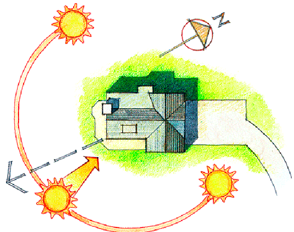

#   Jaleómetro. Manual de instalación y mantenimiento.
 

Lo más importante es que como hospedador de este dispositivo, estás ayudando a desarrollar una red de Ciencia Ciudadana que captura una información clave para saber objetivamente cómo mejorar la calidad de vida de tu barrio.

Este proyecto ha nacido del movimiento Maker y gracias al apoyo de la [AVV Canamunt](https://es-la.facebook.com/avvcanamunt/).

## ¿Qué es el Jaleómetro?

Jaleométro es un sensor experimental diseñado para monitorizar el ruido ambiental de forma automática utilizando energía solar.

## ¿Para qué sirve el Jaleómetro?

**Sirve para monitorizar el ruido que hay fuera de tu casa**. Es muy importante ser consciente de este valor de nuestro entorno que puede afectar a nuestra salud. 

Por otra parte Registra 24h al día lo que ha pasado y mostrando junto con otros sensores, el ruido que hay en tu barrio. También enviará una alerta si el nivel de ruido supera el valor establecido como molesto. Toda esta información la puedes consultar en la web: http://canamunt.mooo.com:48055/ui

## Qué detecta y como se comunica

 

El dispositivo tiene un micrófono con el que mide una vez cada segundo el nivel de ruido ambiental. Analizando la media, máxima y mínima de los valores durante diez minutos al cabo de los cuales transmitirá esta información a un servidor. 

Para ello utiliza una red de transmisión inalámbrica libre y gratuita desarrollada por la iniciativa [TTN](https://www.thethingsnetwork.org/community/mallorca/). Tanto los datos transmitidos cómo la ubicación exacta del sensor están codificados asegurando tu anonimato.
<br>
<br>
<br>

## Instalación
### ¿Dónde colocar el sensor?
El dispositivo está construido para permanecer en el exterior con el objetivo de medir directamente el ruido ambiental. Por lo tanto busca un lugar en tu balcón o terraza con las siguientes características:

- [ ] **Alejado de fuentes de ruido** permanente como altavoces o máquinas como aires acondicionados, lavadoras, etc...

 

- [ ] **La orientado al Sur es lo mas importante** Aunque puede aguantar unos tres días sin iluminación. Sin la luz del sol acabará apagandose y no servirá de nada.

 

> ¿Cómo saber dónde está el Sur? Puedes utilizar la brújula de tu móvil o esperar a que sean las 12 horas del mediodía para colocar el Jaleómetro de manera que sus paneles miren al sol en ese momento.

- [ ] **Cuidado con las vibraciones**. Si sujetas el sensor a un elemento que puede moverse como una barandilla o mástil. Es conveniente que utilices la pieza de espuma adhesiva entre el sensor y el soporte de metal antes de fijarlo con bridas.

### Recomendaciones y cuidados del sensor
- Intenta mantener limpio el panel solar.
- Estate atenta/o a tu buzón de correo. **Si hay alguna incidencia con tu dispositivo, te enviaremos un correo**
- Subscríbete al canal de Telegram: https://t.me/aa_canamunt para recibir las notificaciones y avisos así como para dar a conocer tus opiniones o sugerencias.

```
Agradecemos sinceramente tu ayuda desinteresada a este proyecto de Ciencia Ciudadana
```


